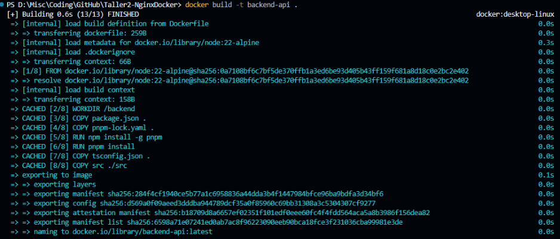
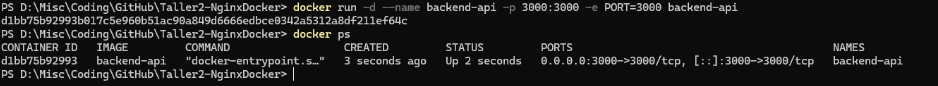
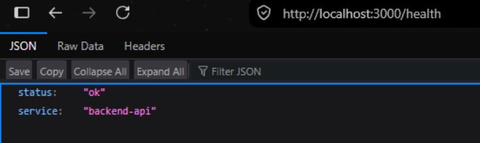
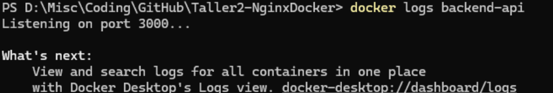
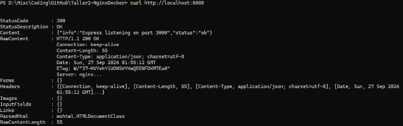
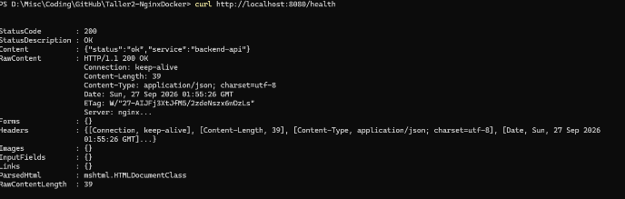
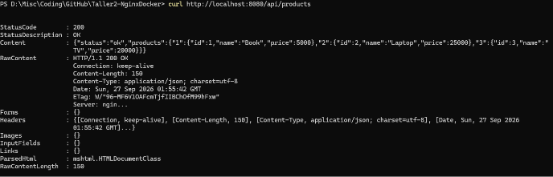
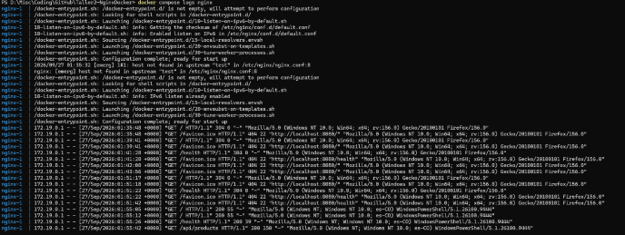
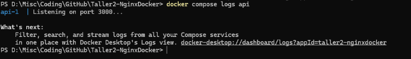
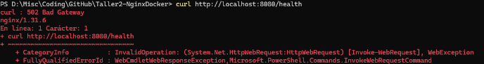

# Taller 2 — Nginx + Docker

API REST desarrollada con Node.js, Express, Docker y Nginx.

## Descripción de la solución
Este proyecto conteneriza una API REST desarrollada con Node.js y Express empleando Docker y Docker compose. Adicionalmente, se evita exponer el backend directamente implementando Nginx como reverse proxy, este el unico punto de entrada publico y redirige el el trafico de los clientes al la API.

Docker Compose crea dos servicios:

api — Backend Node.js + Express en el puerto 3000.  

nginx — Reverse proxy y punto de entrada en el puerto 8080.

Una vez levantados los servicios, la API está disponible en:

http://localhost:8080

Por ejemplo:

GET http://localhost:8080/health  

GET http://localhost:8080/api/products  

GET http://localhost:8080/api/products/1 

## Arquitectura implementada

### Nginx:
Redirecciona el tráfico entrante hacia la API usando http://api:3000
- Puerto Host: 8080
- puerto contenedor: 8080

### API (Backend con Node.js y Express)
Procesamiento de solicitudes
- Puerto interno: 3000

```
     HOST
       |
       | :8080
       v
+-------------+
|    nginx    |
+------+------+
       |
Docker Network
       |
       v
+-------------+
|     api     |
|    :3000    |
+-------------+
```

## Instrucciones para ejecutar proyecto

1. Iniciar proyecto
```bash
docker compose up -d --build
```
2. Verificar el estado de los contenedores 
```bash
docker compose ps
```

## Comandos Docker utilizados

```bash
docker compose up -d --build
```
```bash
docker compose ps
```
```bash
docker compose logs
```
```bash
docker inspect backend-api 
```
```bash
docker build -t backend-api .
```

## Explicacion de ports vs expose

La propiedad `ports` se utiliza publicar un puerto del contenedor hacia la máquina host, haciendo que el servicio sea accesible tanto en la red privada de Docker como desde el exterior a través de localhost. Por otro lado la propiedad `expose` solo indica que puertos dentro de la red interna de Docker sin publicarlos en a interfaz del host. En el proyecto se utiliza `ports` para publicar el puerto 8080 de Nginx y permitir el acceso desde el host, mientras que se utiliza `expose` del puerto 3000 de la API para permitir la comunicación entre contenedores.

## Explicación de localhost vs nombre del servicio Docker

Localhost hace referencia a la propia maquina, pero, cuando se trabaja con contenedores localhost se limita al interior de cada contenedor. Mientras que el nombre del servicio en docker se define en el docker compose para que el contenedor sea reconocible dentro de la red interna de docker. Esto permite que diferentes contenedores puedan comunicarse entre si de forma sencilla sin necesidad de conocer sus direcciones ip.

## Evidencias de las pruebas realizadas.

### Parte 2
Dockerizar el Backend







### Parte 3
Analizar el contenedor



<details><summary>docker inspect backend-api </summary>

{ 

        "Id": "6b5ccc34b0d389ae6d53a33fc4c9962b808d369c683dd0dc87f964e18fce5c70", 

        ... 

            "NetworkMode": "bridge", 

            "PortBindings": { 

                "3000/tcp": [ 

                    { 

                        "HostIp": "", 

                        "HostPort": "3000" 

                    } 

                ] 

            }, 

... 

        "Config": { 

            "ExposedPorts": { 

                "3000/tcp": {} 

            }, 

            "Env": [ 

                "PORT=3000", 

                "PATH=/usr/local/sbin:/usr/local/bin:/usr/sbin:/usr/bin:/sbin:/bin", 

                "NODE_VERSION=22.23.3", 

                "YARN_VERSION=1.22.22" 

            ], 

            "Image": "backend-api", 

... 

        "NetworkSettings": { 

            "Ports": { 

                "3000/tcp": [ 

                    { 

                        "HostIp": "0.0.0.0", 

                        "HostPort": "3000" 

                    }, 

                    { 

                        "HostIp": "::", 

                        "HostPort": "3000" 

                    } 

                ] 

            }, 

            "Networks": { 

                "bridge": { 

                    "IPAMConfig": null, 

                    "Links": null, 

                    "Aliases": null, 

                    "DriverOpts": null, 

                    "GwPriority": 0, 

                    "NetworkID": "5d5c7facae96b2d1ec0e0f4a730464fb44c8f59911ef60242419c98e70a36b9f", 

                    "EndpointID": "a2568ba24c98b1d8a760927df76dd1e638fdc2be83df3b68b6da1edd9f8cc7b0", 

                    "Gateway": "172.17.0.1", 

                    "IPAddress": "172.17.0.2", 

                    "MacAddress": "5e:41:a6:41:93:02", 

                    "IPPrefixLen": 16, 

                    "IPv6Gateway": "", 

                    "GlobalIPv6Address": "", 

                    "GlobalIPv6PrefixLen": 0, 

                    "DNSNames": null 

                } 

            } 

        }, 

... 

} 

</details>

### Parte 8

- curl http://localhost:8080/



- curl http://localhost:8080/health



- curl http://localhost:8080/api/products



- docker compose ps


- docker compose logs nginx



- docker compose logs api



## Explicación del error producido durante el ejercicio de troubleshooting.

Se modifica temporalmente Nginx para utilizar http://localhost:3000 en lugar de http://api:3000 

- ¿Qué error obtiene? 

Se obtiene un 502 Bad Gateway. Ngnix recibió la petición pero no obtuvo una respuesta válida del servidor al que intentó reenviarla (reverse proxy) 



- ¿Por qué ocurre? 

Porque `localhost` intenta buscar dentro del propio contenedor de Nginx el puerto 3000, pero no hay nada ahí, pues en este contenedor solo se está escuchando el puerto 8080. 

- ¿Por qué localhost no representa al contenedor api? 

Porque `localhost` siempre apunta hacia el mismo contenedor/servicio que hace la petición, entonces se llama a sí mismo. 

- ¿Cómo solucionaría el problema? 

Revertir el cambio a de 'localhost` a `api`. Docker traduce automáticamente `api` como el nombre del servicio a su IP interna correspondiente. Después se reconstruye el servicio con docker compose down, up. 

- ¿Qué comando utilizaría para verificar las redes Docker? 

`docker network ls` lista las redes existentes. `docker network inspect taller2-nginxdocker_default` muestra más información de la red para este proyecto. 

## Preguntas

- ¿Cuál es la diferencia entre el puerto del contenedor y el puerto publicado en el host?

El puerto del contenedor es el puerto en el que la aplicación dentro del contenedor está escuchando. Este puerto solo es accesible directamente desde otros contenedores en la misma red de Docker. El puerto publicado es el puerto en el host que Docker redirige hacia el puerto interno del contenedor, este es el que permite poder visualizar http://localhost:3000/health. 

- ¿Por qué http://api:3000 funciona entre contenedores, mientras que http://localhost:3000 no representa correctamente al contenedor api? 

“localhost” siempre se refiere al propio contenedor que hace la petición: si al configurar nginx se usase proxy_pass http://localhost:3000, estaría buscando un servicio escuchando en el puerto 3000 desde el mismo contenedor de nginx. “api” es el nombre del servicio configurado en compose.yaml, docker se encarga de traducir ese nombre a la ip interna real dentro de la red de Docker. 

- Explique la diferencia entre ports y expose en Docker Compose.

ports publica los puertos al host, haciendo que el puerto sea accesible desde fuera del entorno de Docker. 

expose solo documenta el puerto para la red interna de Docker. No abre los puertos como sí lo hace ports. 

